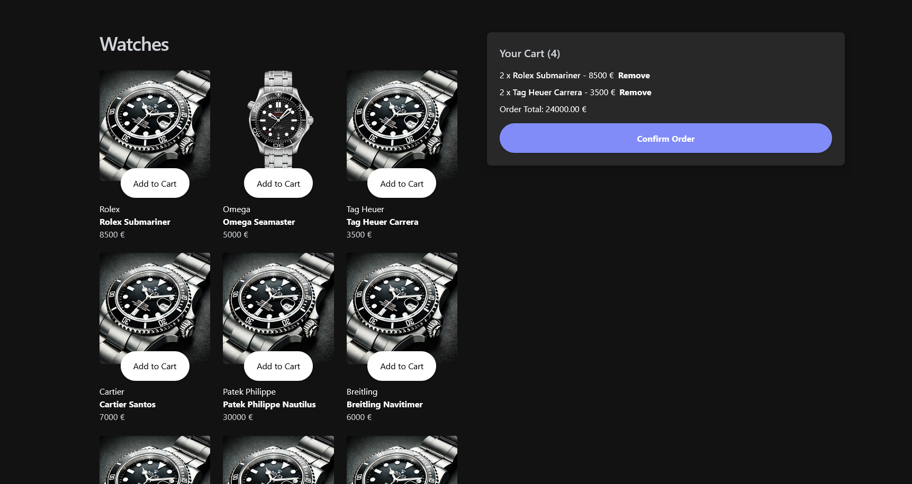

# Frontend Mentor - Product list with cart solution

This is a solution to the [Product list with cart challenge on Frontend Mentor](https://www.frontendmentor.io/challenges/product-list-with-cart-5MmqLVAp_d). Frontend Mentor challenges help you improve your coding skills by building realistic projects.

## Overview

This app is an e-commerce platform designed to allow users to browse watches. The application features a clean and intuitive user interface, allowing users to add items to their cart, view the total price of their selected items, and confirm their order through a modal-based checkout process.

### The challenge

Users should be able to:

- Add items to the cart and remove them
- Increase/decrease the number of items in the cart
- See an order confirmation modal when they click "Confirm Order"
- Reset their selections when they click "Start New Order"
- View the optimal layout for the interface depending on their device's screen size
- See hover and focus states for all interactive elements on the page

### Screenshot

### Links

- Live Site URL: [https://stirring-douhua-ec0aa3.netlify.app/](https://stirring-douhua-ec0aa3.netlify.app/)

### Built with

- React and TypeScript
- CSS Grid
- [Astro](https://astro.build/)
- Tailwind

## Author

- Website - [Aleksi Liukkonen](https://www.aleksiliukkonen.fi)
